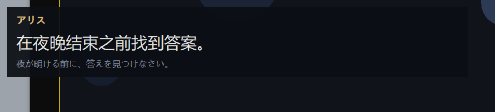
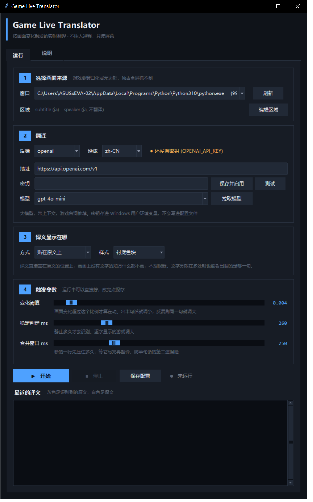
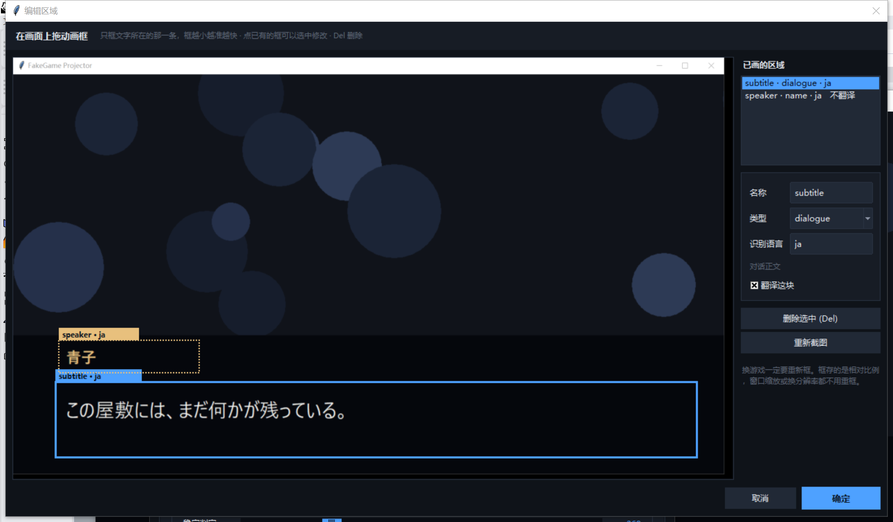
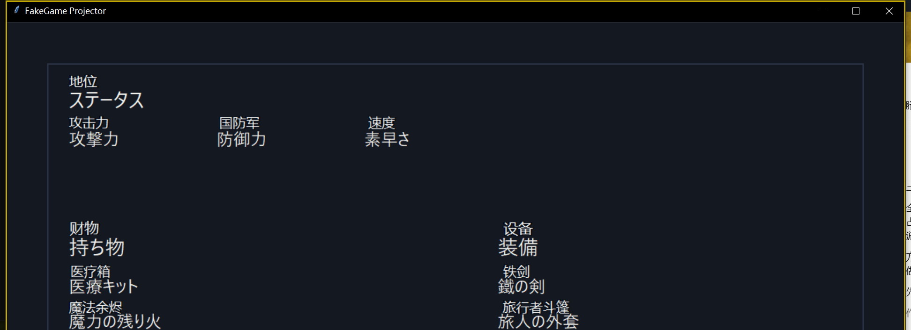

# Game Live Translator

实时翻译**任意窗口**里的文字。**屏幕上显示得出来，它就能翻**——它读的是画面像素，
不是游戏内存，所以不挑引擎、不挑游戏类型，连游戏都不必是：视频、网页、远程桌面
一样能翻。

它**不注入进程、不读内存**，只用系统的 Windows.Graphics.Capture 抓画面。

#### 那什么时候该用它

先看你的游戏能不能被文本 HOOK 工具（Textractor、LunaTranslator）读到。**能读到就用
那些**——直接取文本必然比认图准，也没有认错字的问题。

HOOK 类工具靠挂钩系统的文字绘制接口取文本，所以 2D 视觉小说引擎（吉里吉里、
NScripter、Artemis、Majiro……）它们读得又快又准。而下面这些场景 **HOOK 读不到，
只剩认图这一条路**——本工具就是为它们准备的：

| 场景 | HOOK 为什么读不到 |
|---|---|
| Unity / Unreal 的 3D 游戏 | 文字是贴图或网格，根本不走系统文字接口 |
| 主机游戏（PS5 / Switch / Switch 2） | 画面在主机上，本机只有采集卡送进来的一帧图 |
| 云游戏、远程桌面（GeForce NOW、Parsec、串流） | 同上，本机拿到的只是视频流 |
| 模拟器里的游戏 | 文字在被模拟的内存里，宿主机看不到 |
| 文字直接画进图片的 | RPG Maker 的图片式菜单、立绘上的手写字、按钮贴图 |
| 带反作弊的游戏（EAC / BattlEye） | 注入进程有封号风险；本工具不注入，所以更安全 |
| 视频、直播、录像 | 压根没有进程可挂 |

**这张表说的是 HOOK 的短板，不是本工具的。** 本工具在上面每一行都照常工作，
它自己的限制只有四条，而且跟游戏类型无关：独占全屏抓不到（切无边框即可）、
最小化的窗口抓不到、竖排文字不支持、系统缺 OCR 语言包时要换引擎。详见
[已知限制](#已知限制)。

Real-time OCR translation of any window. It reads pixels, not game memory,
so the engine and the genre do not matter — and neither does it being a game:
a video, a web page or a remote desktop all work the same way. No process
injection and no memory reading; capture goes through Windows.Graphics.Capture.

Use a text hooker instead when one works on your game — reading the text will
always beat reading the picture. This is for the cases where hooking has
nothing to hook: text living in a texture rather than the drawing API, a
console arriving through a capture card, an emulator's guest memory, an
anti-cheat that treats injection as an attack, or a recording with no process
behind it at all.

[English](#english) · [中文](#中文)



---

## 中文

### 它解决什么问题

现成的屏幕翻译工具基本都是**定时 OCR**：每隔 N 毫秒识别一次。游戏场景变化快的时候，这个模型没有能用的设定——

- 调快：过场动画每一帧都在动，OCR 和翻译 API 被疯狂空烧，还满屏都是识别到一半的残句
- 调慢：一句一闪而过的台词直接漏掉

这个项目换了个思路：**不定时，按画面变化触发**。

```
静止 ──(像素动了)──► 等待稳定 ──(静止够 stable_ms)──► 触发 OCR
  ▲                      │                              │
  └──────────────────────┴──────────────────────────────┘
```

每个区域独立跑这个状态机。效果是 **OCR 只在画面刚停下来的那一刻跑一次**：过场动画狂闪两秒钟，一次都不触发；字幕出现并停住，`stable_ms` 之后精确触发一次。

实测（22 秒，逐字打字机显示 + 背景持续动画）：**15 次 OCR，167 次重复被抑制，11/11 整句正确，0 个残句。**

### 还做了这些

| 问题 | 做法 |
|---|---|
| 逐字打字机显示导致翻译半句 | 文本层 250ms **合并窗口**：新行先压一下，期间来了它的前缀延长版就替换 |
| 窗口被遮挡就抓不到画面 | 用 **WGC** 按窗口句柄抓，被遮挡、丢副屏、滚出屏幕外都照抓 |
| 网络慢时字幕越落越远 | 每个区域只保留**最新一条**待处理，过期的直接丢 |
| 代词、省略主语翻错 | LLM 后端带**滚动上下文**，前几句一起发 |
| 菜单、重复台词反复烧 API | **翻译缓存**，命中即时返回 |
| 人名框和字幕条互相干扰 | **多区域**独立管线，各有各的语言和触发参数 |

### 环境要求

- Windows 10 1903+ 或 Windows 11（两个都测过）
- Python 3.10+
- 装了对应语言的 **Windows OCR 语言包**（用 `python main.py languages` 查）

> Win10 和 Win11 的 WGC 参数支持不一样（`draw_border` 是 Win11 才有的，Win10 上直接抛异常；`minimum_update_interval` 在 Win10 上会被静默忽略）。本项目**运行时探测能力并逐级降级**，帧率也在软件层兜底限流，不用你操心。

### 安装

```bash
pip install -r requirements.txt
```

### 快速开始（PC 上的游戏）

不需要采集卡，也不需要 OBS，直接抓游戏窗口。

**1. 把游戏切成窗口化或无边框窗口**

**别用独占全屏。** 独占全屏下 WGC 抓不到画面，而且悬浮窗也压不到游戏上面。无边框窗口两个问题都没有。

**2. 开控制台**

双击 `启动控制台.bat`，或者：

```bash
python main.py gui
```



在里面选游戏窗口 → 点「编辑区域」在画面上拖框圈出字幕 → 选翻译后端 → 「开始」。

「说明」页里有完整的功能说明：原理、每个参数怎么调、识别不准怎么办、隐私说明。



区域编辑器直接在截下来的画面上拖框。框按类型着色，点已有的框能选中改名称/类型/语言。

**框越小越准越快，只框字幕条，别框整个画面。** 人名框单独框一个、类型选 `name`，它就只更新悬浮窗上的说话人不去翻译。

游戏时建议在悬浮窗上右键开**鼠标穿透**，这样点击会落到游戏里，悬浮窗不挡操作。

出问题先跑 `python main.py doctor`，它会把每个环节挨个查一遍。

> 三个滑块**运行中可以实时调**，不用停下来改 JSON 再重启——一边看着状态栏的计数一边拧。调好了点「保存配置」。

**纯命令行也行**（不想开 GUI 的话）：

```bash
python main.py windows
python main.py pick --window "游戏窗口标题的一部分" --lang ja
python main.py run
```

> **PC 上的 Galgame / 视觉小说建议先试 HOOK 类工具**（LunaTranslator、Textractor）。能 HOOK 到的引擎，直接读文本必然比 OCR 准，也没有识别错字的问题。本工具的定位是 **HOOK 不可用的场合**：引擎不支持、3D 游戏、图片式文字、或者画面根本不在本机（采集卡）。
>
> 反过来，本工具**不注入进程、不读内存**，只用系统的 Windows.Graphics.Capture 抓画面，所以带反作弊的游戏用它比用 HOOK 类工具安全。

### 快速开始（主机 + 采集卡 + OBS）

画面不在本机时，先在 OBS 里造一个干净的画面窗口：右键预览画面 → **窗口投影器（预览）**，得到一个只有游戏画面、没有 OBS 界面的独立窗口。之后步骤跟上面完全一样，把 `--window` 指向这个投影器窗口即可。

> 有 HDMI 直通口的采集卡，建议用直通那份画面玩，OBS 这份只喂给本工具——手感零影响，而且投影器窗口可以直接丢到副屏或者被别的窗口盖住，WGC 照抓不误。

### 命令

| 命令 | 作用 |
|---|---|
| `gui` | 打开控制台（推荐从这开始） |
| `windows` | 列出能抓的窗口 |
| `languages` | 列出已装的 Windows OCR 语言 |
| `doctor` | 逐项自检：依赖、语言包、配置、窗口、翻译后端密钥 |
| `shot --window X` | 存一帧图，用来对区域 |
| `pick --window X` | 拖框选区域并写进配置 |
| `tune` | 实时打印触发器数值，用来定阈值 |
| `glossaries/` | 自带 8 份术语表，见下面「自带哪些术语表」 |
| `learn` | 玩完跑一次：从会话日志提取人名/技能名等写入待审术语文件，过目后再启用 |
| `run` | 开跑（`--debug` 打印每次 OCR 和翻译；`--no-overlay` 只走控制台） |

### 译文显示在哪

默认**贴在原文位置上**：每句译文画在它对应的原文那里，画面上没有文字的地方什么都不画。所以它不占视野，而且一屏有好几处文字时也能看出翻的是哪一句——这是固定字幕条做不到的。



| 设置 | 选项 | 说明 |
|---|---|---|
| `overlay.mode` | `inplace` / `bar` | 贴在原文上 / 底部字幕条。对话为主的游戏可以用 `bar`，读起来更连贯 |
| `overlay.label_style` | `plate` / `outline` | 衬底色块（盖住原文，任何背景都清楚）/ 只描边（更不挡画面，但原文还在，所以译文会自动排到原文上方） |
| `overlay.placement` | `over` / `above` / `below` | 盖住 / 上方 / 下方 |

菜单那种文字分散在好几处的画面，框一个大框把整片圈进去、类型选 `info` 就行——里面每一条会分别识别、分别翻译、分别贴回各自的位置，并且合并成**一次**请求。

### 翻译准不准

译文不对通常是两个完全不同的原因，先分清再动手：

**一、OCR 认错字。** 比如 `防御力` 被识别成 `防御カ`（力 vs 片假名 カ），于是翻成了「国防军」。喂进去的原文本身就是错的，**光换翻译引擎救不了**。两条路：从识别下手（把框缩小、见下面「OCR 认错字的时候」），或者打开 `translate.vision` 让模型对着画面纠错——对话区发它自己的截块；菜单整片截图会带着每条的编号框一起发过去，模型逐条对着框里的像素校对识别结果再翻译，同形字认错就能被图像救回来。

> **发图能救「认错」，救不了「没认出来」——而这两种区域的表现不一样。**
> 逐条贴回的 `info` 区域，位置来自本地识别的行框：没被识别到的行就没有框、
> 没有编号，也没有地方贴译文，发图也补不回来。对话区没有这个限制，整块只出
> 一条译文、位置取自整体范围。实测同一张标题画面：
>
> ```
> 花体标题   压在插画上的描边标题，本地识别把中间整段读丢，只剩零散假名
>   纯文字   凭空编造出一句意思完全不沾边的话
>   发图     从像素里把丢掉的那段读了回来，与官方译文基本一致
>
> 菜单项     粉色描边的 CONTINUE 压在花背景上，本地识别整条漏掉
>   发图     照样没有 —— 没框就没有编号，模型不会被问到它
> ```
>
> 所以文字挤、识别容易漏的画面，区域类型设成对话比设成 `info` 更吃得到发图的好处。

**二、引擎不认识游戏术语。** `ステータス` 翻成「地位」、`持ち物` 翻成「财物」、`装備` 翻成「设备」——这些词在游戏里有固定译法，通用引擎当普通词处理就全错。两个办法：

- **换成大模型后端**（`openai` / `anthropic`）。提示词里已经写明了这是游戏 UI 或对白、短名词多半是界面标签、要用游戏里的惯用译法
- **用术语表**。整行精确命中时直接用表里的译法，**连请求都不发**，所以它既是准度手段也是提速手段；部分命中时把相关条目塞进提示词

实测同一屏菜单，加了 8 条术语之后 4 个错译被修正、请求数从 12 降到 7：

```
修正前   地位 / 速度 / 设备 / 财物 …
修正后   状态 / 敏捷 / 装备 / 道具 …
```

上面这几个词换个游戏也还是这个意思，所以自带了一份通用表
`glossaries/common-ja-zh.json`（180 条：开始存档、按钮、菜单项、商店动作、
属性数值、设置页、提示帮助）。收录标准是**这个词在几乎所有日文游戏里都是
同一个意思，而且通用引擎容易翻错**；各游戏叫法不同的（`技量`、`理力`、
`会心`、属性名）不收，留给下面的分层表。

#### 自带哪些术语表

一共 8 份，540 条（去重后 476 条），**分三层叠加，后面的盖前面的**：

| 层 | 文件 | 条数 | 什么时候用 |
|---|---|---|---|
| 0 通用 | `common-ja-zh.json` | 180 | 永远放第一个 |
| 1 类型 | `galgame-ja-zh.json` | 85 | 视觉小说 / Galgame |
| 1 类型 | `souls-series-ja-zh.json` | 75 | 任意魂系 |
| 2 单作 | `darksouls3-ja-zh.json` | 87 | 黑暗之魂3 |
| 2 单作 | `eldenring-ja-zh.json` | 35 | 艾尔登法环 |
| 2 单作 | `sekiro-ja-zh.json` | 40 | 只狼 |
| 2 单作 | `bloodborne-ja-zh.json` | 33 | 血源诅咒 |
| 2 单作 | `duskbloods-ja-zh.json` | 5 | 黄昏血族（**种子表**，见下） |

`duskbloods` 只有 5 条是有意为之：游戏尚未发售，没人见过它的菜单，界面词编出来
匹配不到任何东西。收的只有官方公开资料里确认过的专有名词。**注意中文报道写的
「血誓者」「初血」不是游戏内日文**，官方日文是 `黄昏の血族` 和
`始まりの血（ファーストブラッド）`——术语表的键照中文报道写就一条都命中不了。
正确用法是叠 `common + souls-series + duskbloods` 打底，然后玩的时候用
`main.py learn` 让它自己长。

分层是有意义的：`スキル` 一般译「技能」，只狼官方译「招式」；`インベントリ`
一般译「物品栏」，魂系官方译「持有物品」。**单作表放最后就能盖掉通用译法**，
这正是要的效果。`tools/check_glossary_files.py` 会把所有跨表覆盖列出来，
并在同一层出现分歧时报错（那种情况谁生效取决于配置顺序，是真 bug）。

```jsonc
// 玩只狼
"glossary_file": [
  "glossaries/common-ja-zh.json",        // 通用在前
  "glossaries/souls-series-ja-zh.json",  // 系列共通
  "glossaries/sekiro-ja-zh.json"         // 单作在后，盖掉前两层
],

// 玩 galgame
"glossary_file": [
  "glossaries/common-ja-zh.json",
  "glossaries/galgame-ja-zh.json"
],

"glossary": { "固有名詞": "固有名词" }  // 写在配置里的最优先，适合临时改一两个
```

叠三层实测载入 **0.4 毫秒**，可以放心叠。

给新游戏建表：复制 `glossaries` 里任意一个改名，**只写跟通用表不一样的词**，
通常几十条就够，一边玩一边把翻错的补进去。角色名放进去可以避免前后译名飘。
只在文本里出现过的术语才会被送进提示词，所以术语表写多长都不额外花钱。

**不想手动积累的话，玩完跑 `python main.py learn`。** 它把这局日志里的
原文和译文交给模型，只提取人名、地名、技能名这类必须前后一致的专有名词
（宁缺毋滥：普通名词一律不收，模型编造的、画面上没出现过的词条会被丢掉），
写进 `glossaries/suggested-terms.json`。**这个文件不会被自动使用**——
打开删掉不要的，再把它加进 `glossary_file` 才生效；重复跑会合并，已经
进了正式术语表的词条自动退场。

**输出端还有一道保险：`translate.fixes`。** 某个词模型怎么劝都翻错时，
写一行 `"错词": "对词"`，译文显示前直接替换。术语表管喂进去的原文（需要
OCR 认出那个词才命中），这个管吐出来的译文（无条件生效），两头夹击。
`fixes_file` 的用法和 `glossary_file` 完全一样。

#### 已经有整本译文的话，直接拿来当术语表

RPG Maker 游戏常有现成的离线译文：MTool 之类的工具把游戏数据里的字符串全
抽出来、批量译好、运行时注回去，产物是一个 `AI翻译文件.json`，格式就是
`{"原文": "译文"}` —— **跟本工具的术语表格式完全一样**，直接指过去即可：

```jsonc
"glossary_file": [
  "glossaries/common-ja-zh.json",
  "D:/游戏/某游戏/AI翻译文件.json"    // 整本剧本
]
```

命中的行不发请求、零延迟，而且整局译名一致。实测一份 88,711 条的真实文件：

```
载入          52ms
建折叠索引    113ms   一次性
命中一行       0ms    直接查表，不联网
没命中一行     0.002ms
```

没被收录的部分（画成图片的菜单、运行时拼出来的文本）照常走模型，所以这是
纯粹的增益。注意这条路只对**能抽出文本的引擎**成立；抽不出来才需要 OCR，
那正是本工具存在的理由——两者叠加最省事。

### 翻译后端

配置里的 `translate.backend`：

- `google` — **零配置**，不用密钥，适合先跑起来看看。但它没有上下文
- `openai` — 任何 OpenAI 兼容端点（改 `base_url` 即可接自建网关）
- `anthropic` — Claude
- `deepl` — DeepL API
- `none` — 不翻译，只出 OCR 原文（调 OCR 参数时用，不烧 API）

**游戏台词强烈建议用 LLM 后端。** 实测同一句 `待って。その先は危険だわ。`：

- Google：`不挂断。外面很危险。` — `待って` 被当成打电话的"等一下"了
- 带上下文的 LLM：能正确理解成"站住，前面危险"

选了需要密钥的后端，控制台第 2 区会出现**地址 / 密钥 / 模型**三行：

- **地址** — API 入口。默认官方地址，改成自建网关、中转站或本机模型服务都行（含端口，例如 `http://127.0.0.1:11434/v1`）
- **密钥** — 粘贴后点「保存并启用」立刻生效，不用重开；点「测试」会真发一次请求把译文显示出来
- **模型** — 填好地址和密钥点「拉取模型」，会去问这个端点它实际提供哪些模型，然后从下拉框里选；也能直接手打

密钥存进 **Windows 用户环境变量**（`OPENAI_API_KEY` / `ANTHROPIC_API_KEY` / `DEEPL_API_KEY`），**不写进配置文件**，所以配置文件可以随便分享或提交。命令行也可以设：

```bash
setx OPENAI_API_KEY "sk-..."
```

#### 一块屏幕上其实是两种活

菜单、属性面板是短名词，要的是术语准；对话要上下文、要语气、还要模型肯翻。
而**菜单是流量的大头，对话才是真正需要好模型的少数**。全用一个模型，就得在
「每条界面标签都付强模型的延迟」和「对话将就用快模型」之间二选一。

`translate.role_models` 按区域类型分配模型——只换模型名，地址、密钥、上限都不变：

```json
"translate": {
  "openai": { "model": "强模型（对话用）", "...": "..." },
  "role_models": { "info": "便宜快的模型", "choice": "便宜快的模型" }
}
```

键就是区域类型：`dialogue` / `name` / `choice` / `info`。留空（默认）就是全部走主模型，
和以前完全一样。**缓存是所有类型共用的**，同一句话不会因为出现在两种区域里就翻两遍。

> 先别急着换模型。实测 40 秒的一局：菜单区触发几十次，其中缓存命中 50 次、
> 术语表命中 14 次，真正发出去的请求只有 9 次。**把术语表喂饱比换模型更省**，
> 而 `main.py learn` 就是干这个的。

另外还有一个只在必要时才动的第二模型：`openai.fallback_model` —— 只有主模型
**拒译或答非所问**时才用它重试一次。不同模型对成人向台词的态度差别很大，
全程换成肯翻的模型要付三倍延迟，而后备只在被拒的那几句上付。

### 调参

控制台里三个最常用的滑块可以**运行中实时调**。要看具体数字就跑 `python main.py tune`，让游戏静止一会儿，再让它动起来：

```
subtitle: d=0.0004 peak=0.4213 edge=0.0486 fires=3
```

- `d` — 这一帧变了多少（变化格子的比例）
- `peak` — 见过的最大变化
- `edge` — 文字密度，低于 `blank_edge_ratio` 就当作"这块空了"

把 `trigger.motion_threshold` 设在**静止时的值和动起来时的值之间**。采集卡画面有压缩噪点，静止时的 `d` 不会是 0，照着实测值定。

| 参数 | 默认 | 说明 |
|---|---|---|
| `motion_threshold` | 0.004 | 超过这个比例的格子变了 = 画面在动。一个汉字/假名约占 0.008，**别设到 0.008 以上**，否则逐字显示的游戏会有大约十分之一的句子被切一半 |
| `stable_ms` | 260 | 静止多久算稳定。**打字机式显示的游戏调大** |
| `min_interval_ms` | 150 | 同一区域两次触发的最小间隔 |
| `max_hold_ms` | 2500 | 一直不稳定也强制触发一次（字幕后面有动态背景时靠它） |
| `blank_edge_ratio` | 0.004 | 低于此值判定区域为空 |
| `ocr.upscale` | 2.0 | 识别前先放大多少倍 |
| `ocr.coalesce_ms` | 250 | 新行先压这么久，等它写完 |

#### 对症拧哪个

| 症状 | 拧什么 | 为什么 |
|---|---|---|
| 只翻出半句话 | `motion_threshold` → 0.003，`coalesce_ms` → 400 | 字还没打完就以为画面停稳了。逐字显示的游戏两个一起调 |
| 同一句反复翻来翻去 | `motion_threshold` → 0.008 | 采集卡噪点、呼吸灯、火光这类小幅闪动被当成了「画面变了」 |
| 要等好几秒才出字幕 | `stable_ms` → 150 | 城镇、战斗里画面始终静不下来，只能等 `max_hold_ms` 兜底 |
| 一屏要等十几秒 | **不是这些参数**，换个快的模型 | 瓶颈在网络和模型，见上面的横评 |
| 完全没反应，识别数一直 0 | **不是这些参数**，检查窗口和区域 | 多半抓错了窗口，或框在没文字的地方 |

#### OCR 认错字的时候

**先别动 `upscale`。** 实测过：拿一份 1287×759 的 RPG Maker 菜单，放大
1/2/3/4 倍，正确率都是 12 条里对 8~9 条，**错的还是同样那四个词**，只是耗时
从 39ms 涨到 312ms。预处理更糟——`contrast` 2.5、`binarize`、`invert+binarize`
三种设置**一条都没读对**。

```
放大 1.0   9/12    39ms        对比 2.5    0/12
放大 2.0   8/12    89ms        二值化      0/12
放大 3.0   9/12   170ms        反相+二值   0/12
放大 4.0   8/12   312ms
```

默认设置已经是能拿到的最好结果。真正有效的顺序是：

1. **把框缩小，只留文字** —— 图标和花纹进了框，就会被认成字粘到词上
2. **把这个游戏的术语表补上**，尤其是被认错的那几个词。工具会把
   丢失的浊点和 力/カ、口/ロ 这类同形字折叠掉再比对，所以术语表能兜住
   一部分认错（见上面的术语表一节）
3. **有整本译文就直接挂上**（MTool 那一节），命中的行根本不经过模型
4. 描边字/花体字：在 OBS 里单独做一个场景，裁剪到只剩字幕条 + 加
   「色彩校正」滤镜拉对比度降饱和，用**源投影器**输出，让本工具抓那个窗口
5. 深底浅字反了才开 `ocr.invert`

### 悬浮窗

拖动即可移动。右键菜单可以切换原文显示、切换**鼠标穿透**（穿透后鼠标点击会落到下面的窗口，适合游戏时用，但也就拖不动了）。ESC 退出。

### 已知限制

- **只有独占全屏不行。** 无边框全屏、窗口化全屏都没问题（现在多数游戏的「全屏」就是无边框）。独占全屏下画面绕过了系统合成器，抓不到，而且任何悬浮层都盖不上去——这是系统限制，去画质设置里改成无边框即可
- **最小化的窗口抓不到。** WGC 的限制，窗口可以被遮挡、可以丢副屏，但不能最小化
- 竖排文字没做适配（日式 AVG 的竖排对白目前不行）
- Windows OCR 没有对应语言包时得换 `"engine": "rapidocr"`（慢约 40 倍，日文准度也差些）

---

## English

### What it does

Existing screen translators poll: run OCR every N milliseconds. For a game
that moves, there is no good value for N — fast enough to catch a line that
flashes past means burning OCR and API calls on every frame of every
animation, and slow enough to be cheap means missing lines.

This one is **change-triggered** instead. Per region, a small state machine
over a cheap visual fingerprint fires OCR exactly once, right after the
picture stops moving:

```
quiet ──(pixels moved)──► settling ──(still for stable_ms)──► FIRE
  ▲                          │                                │
  └──────────────────────────┴────────────────────────────────┘
```

Measured over 22 s against a typewriter-reveal subtitle with a continuously
animating background: **15 OCR fires, 167 repeat frames suppressed, 11/11
complete lines, 0 partial sentences.**

### Design notes

- **Windows OCR by default.** Benchmarked against an ONNX pipeline on the same
  images: 14 ms vs 597 ms on Japanese, 4 ms vs 608 ms on English — and Windows
  OCR was also the more accurate of the two on Japanese. RapidOCR stays as a
  fallback for machines without the language pack.
- **WGC capture by window handle,** so the target keeps producing frames while
  occluded, on another monitor, or off-screen. It cannot capture a *minimised*
  window.
- **Latest-wins mailboxes** between stages. When the network lags, stale lines
  are dropped rather than queued — a translation of the line before last is
  worse than nothing, because it lands under the wrong scene.
- **Time-based settle gate, not frame-based.** WGC honours
  `minimum_update_interval` on Windows 11 and silently ignores it on Windows
  10, where frames arrive at full compositor rate (~240 fps here). A frame
  counter reads a typewriter's 40 ms inter-character pauses as "settled" and
  ships half a sentence; milliseconds behave the same at any capture rate.
  Frame rate is additionally throttled in software.
- **Text-level coalescing** catches the tail of a reveal when its last one or
  two characters fall below the motion threshold, so the fix does not depend
  on tuning a threshold perfectly for a game nobody has tested.

### Requirements

Windows 10 1903+ or Windows 11, Python 3.10+, and the Windows OCR language
pack for your source language (`python main.py languages`).

### Install and run

```bash
pip install -r requirements.txt
python main.py gui
```

The control panel picks the window, draws the regions on a captured frame,
selects a backend, and starts. Its three sliders apply to a running pipeline,
so thresholds get tuned against the live game instead of by editing JSON and
restarting. The CLI covers the same ground:

```bash
python main.py windows
python main.py pick --window "<part of the window title>" --lang ja
python main.py run
```

Point it straight at the game window for a PC game, or at an OBS windowed
projector when the picture arrives over a capture card. Run the game
**windowed or borderless, not exclusive fullscreen** — WGC cannot capture an
exclusive-fullscreen window, and an overlay cannot sit on top of one either.

For a PC visual novel on a supported engine, try a hooking tool first
(LunaTranslator, Textractor): reading the text directly will always beat
reading it off pixels. This is for when that is not available.

`python main.py doctor` checks every moving part and tells you which one is
broken.

### Backends

`google` (keyless, zero setup, no context), `openai` (any OpenAI-compatible
endpoint), `anthropic`, `deepl`, `none`. Use an LLM backend for game dialogue:
on `待って。その先は危険だわ。` the keyless engine returns "don't hang up",
reading the line as a telephone idiom, which context fixes.

Keys are read from the environment first (`OPENAI_API_KEY`,
`ANTHROPIC_API_KEY`, `DEEPL_API_KEY`), so config files stay safe to commit.

### Testing without a capture card

```bash
python tools/fake_game.py          # animated background + typewriter subtitles
python main.py pick --window "FakeGame Projector"
python main.py run --debug
```

## License

MIT — see [LICENSE](LICENSE).
